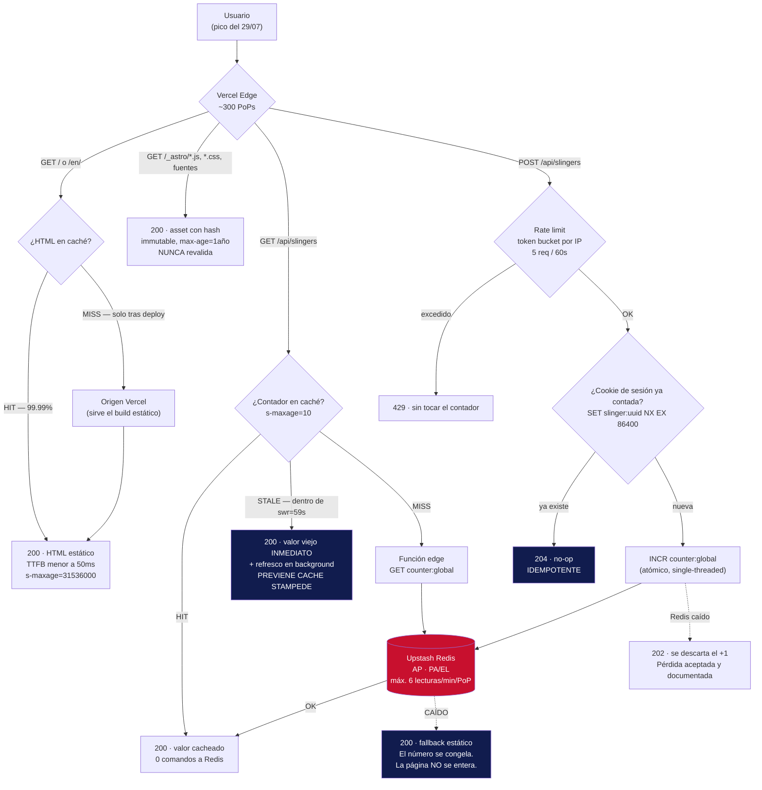

# Architecture — Spider-Man: Brand New Day (fan landing)

> Proyecto no oficial, sin afiliación con Marvel o Sony. Toda la identidad visual es original
> y generada por código (CSS/SVG). No se usan assets licenciados de ningún tipo.

**Nivel de criticidad declarado: L1** (landing pública, sin PII, sin transacciones de valor).
La profundidad de threat modeling y SRE se calibra a ese nivel: STRIDE se aplica **solo** al
único vector expuesto que acepta escrituras, y se omite LINDDUN por ausencia de datos
personales. Inflar esto con el aparato de un sistema L3 sería teatro, no rigor.

**Restricción dominante:** la landing debe sostener un pico de tráfico concentrado el 29/07
sin degradar. Todas las decisiones de abajo se subordinan a eso.

---

## Índice

1. [ADR-001 — Framework: Astro sobre Next.js](#adr-001--framework-astro-sobre-nextjs)
2. [ADR-002 — Rendering y caché para el pico](#adr-002--rendering-y-caché-para-el-pico)
3. [ADR-003 — Animación fluida con presupuesto de JS](#adr-003--animación-fluida-con-presupuesto-de-js)
4. [ADR-004 — Sistema visual original sin infringir IP](#adr-004--sistema-visual-original-sin-infringir-ip)
5. [ADR-005 — Estrategia de media y LCP](#adr-005--estrategia-de-media-y-lcp)
6. [ADR-006 — Datastore del contador global](#adr-006--datastore-del-contador-global)
7. [Presupuesto de performance](#presupuesto-de-performance)
8. [Flujo de request y caché](#flujo-de-request-y-caché)
9. [Análisis de fallo del vector dinámico](#análisis-de-fallo-del-vector-dinámico)
10. [Trazabilidad](#trazabilidad-requisito--decisión--verificación)

---

## ADR-001 — Framework: Astro sobre Next.js

**Estado:** aceptado.

### Contexto

La oferta valora React, Angular, Vue, Astro y Next.js indistintamente, pero exige de forma
explícita *"asegurar que el sitio aguante picos de tráfico masivos"*. El contenido de la
landing es **fijo**: no hay usuario autenticado, no hay personalización, no hay datos que
cambien por request. La única pieza dinámica es un contador global (ver ADR-006).

Esto define el problema con precisión: **el 99% de la página es un artefacto inmutable que
puede pre-computarse una vez y servirse N veces desde el borde.** Cualquier arquitectura que
compute HTML por request está pagando un costo que este dominio no justifica.

### Opciones

| | Astro 5 (islands, SSG) | Next.js 15 (App Router, ISR) |
|---|---|---|
| JS enviado al cliente por defecto | 0 KB | ~90 KB (runtime React + hydration) |
| Modelo de hidratación | Parcial, isla por isla, declarativo (`client:visible`) | Global — el árbol entero se serializa e hidrata |
| Costo de un pico de 100× | Cero: el HTML ya existe en el CDN | Cero *si* todo cachea; riesgo real si algo se escapa a SSR |
| Riesgo de regresión de performance | Bajo: enviar JS es un acto explícito y visible en el diff | Alto: un `"use client"` mal puesto arrastra el bundle |
| Señal enviada a un revisor senior | "Entendí el problema" | "Usé lo que uso siempre" |

### Decisión

**Astro 5 con adapter de Vercel** (no `output: 'static'` puro: el endpoint del contador
necesita runtime). Las secciones son estáticas; solo el contador es una isla hidratada.

El argumento decisivo no es que Next.js no pueda hacer esto — puede. Es que **en Astro el
camino de menor resistencia produce el resultado correcto, y en Next.js el camino de menor
resistencia produce ~90 KB de JS que esta página no necesita.** Bajo presión de tiempo (16 h),
elegir el framework cuyo default es el óptimo es una decisión de ingeniería, no de gusto.

Además: Astro **es** el terreno de Midudev. Presentarse a su oferta con la herramienta que él
evangeliza, usada correctamente, es una señal barata y de alto retorno.

### Consecuencias

- **Positivas:** el presupuesto de JS (§7) se vuelve trivialmente alcanzable. Zero-JS por
  defecto convierte el *performance budget* en algo que hay que romper activamente, no en algo
  que hay que defender.
- **Negativas:** si el proyecto creciera a rutas autenticadas o dashboards con estado
  compartido, Astro dejaría de ser la elección correcta. **Se acepta**: este proyecto no crece
  en esa dirección y la decisión se documenta como local a su alcance.
- **Riesgo:** el ecosistema de librerías de animación asume React. Se mitiga en ADR-003 con
  una decisión de no usar ninguna.

### 30 segundos para Midu

> "El contenido de la landing no cambia entre usuarios: es un artefacto que se puede computar
> una vez. Next.js me hubiera dado la misma página con ~90 KB de React que ningún usuario
> necesita ejecutar. Astro me deja bajar a cero JS por defecto y pagar bytes solo por la única
> isla que de verdad es interactiva. Bajo un pico de tráfico, el JS que no envío es el que
> nunca se convierte en un problema."

---

## ADR-002 — Rendering y caché para el pico

**Estado:** aceptado.

### Contexto

El 29/07 el tráfico llega concentrado y con una distribución brutalmente sesgada: **la enorme
mayoría de los requests pide el mismo recurso** (`/` y `/en/`). Esto es la mejor noticia
posible: un workload con altísima localidad de referencia es el caso ideal para un CDN.

El riesgo real de un pico no es "el servidor es lento". Es **origin overload**: que cada
request llegue al origen porque el caché no está haciendo su trabajo. Un `Cache-Control`
ausente o mal puesto convierte un CDN de 300 PoPs en un proxy caro.

### Opciones

1. **SSR por request** — descartado. Recomputar HTML idéntico N veces es quemar CPU por
   nada, y hace del origen un cuello de botella con exactamente la forma que la oferta pide
   evitar.
2. **ISR / revalidación temporal** — descartado para el HTML: resuelve un problema
   (contenido que cambia) que **este proyecto no tiene**. Introduce complejidad y una ventana
   de staleness sin comprar nada.
3. **SSG + CDN inmutable, con el fragmento dinámico aislado** — elegido.

### Decisión

**Prerender total del HTML en build. El estado dinámico se aísla en un único endpoint,
cacheado en el edge con `stale-while-revalidate`.**

Política de caché explícita, por clase de recurso:

| Recurso | Header | Razón |
|---|---|---|
| HTML (`/`, `/en/`) | `public, max-age=0, s-maxage=31536000, stale-while-revalidate=86400, must-revalidate` | El navegador siempre revalida; el CDN sirve desde memoria. Se purga por deploy (Vercel invalida automáticamente). |
| Assets con hash (`/_astro/*.js`, `*.css`, fuentes) | `public, max-age=31536000, immutable` | El nombre contiene el hash del contenido: si cambia el contenido, cambia la URL. Nunca hay que revalidar. |
| `GET /api/slingers` | `public, s-maxage=10, stale-while-revalidate=59` | Ver abajo. |
| `POST /api/slingers` | `no-store` | Mutación. |

**El `s-maxage=10` del contador es la decisión central de este ADR.** Bajo un pico de, por
poner un número, 50 000 lecturas por minuto, ese header colapsa el fan-out a **como máximo 6
lecturas por minuto contra Redis por PoP**. El resto se sirve desde el borde. Y el
`stale-while-revalidate=59` garantiza que **ningún usuario espera nunca por Redis**: si la
entrada está vencida, el CDN devuelve el valor viejo de inmediato y refresca en segundo plano.

Esto es una decisión de diseño con nombre: **cache stampede prevention.** El caso patológico
que evita es el que mata sistemas reales — la entrada expira y 10 000 requests concurrentes
salen simultáneamente al origen a recomputar lo mismo. `stale-while-revalidate` es el
mecanismo que lo impide, y es la razón por la que un contador global "imposible de escalar"
se vuelve trivial.

### Consecuencias

- **Positivas:** el TTFB del HTML es el de un archivo estático en el borde (~30-50 ms). El
  origen es irrelevante para el 99.99% del tráfico. Un pico de 100× no cambia nada material.
- **Negativas:** el contador puede estar hasta ~69 s desactualizado (10 s de frescura + hasta
  59 s de ventana stale). **Se acepta explícitamente**: es un contador de fans, no un saldo
  bancario. La consistencia eventual con un bound documentado es la respuesta correcta, y
  decirlo en voz alta es parte del diferencial.
- **Riesgo:** un deploy invalida el caché de HTML y produce un breve pico de origin fetches.
  Irrelevante a esta escala; se mitiga no deployando el 29/07.

### 30 segundos para Midu

> "El HTML es inmutable, así que vive en el CDN con `s-maxage` de un año y se purga por deploy.
> El único punto dinámico es el contador, y ahí está lo interesante: le puse `s-maxage=10` con
> `stale-while-revalidate=59`. Eso significa que, aunque entren 50 000 personas por minuto,
> Redis recibe como mucho 6 lecturas por minuto y por PoP, y ningún usuario espera nunca por
> él — si el caché venció, se sirve el valor viejo y se refresca por detrás. Es prevención de
> cache stampede, y es la diferencia entre un contador que aguanta y uno que se cae."

---

## ADR-003 — Animación fluida con presupuesto de JS

**Estado:** aceptado.

### Contexto

La oferta pide navegación *"tan fluida como Spider-Man balanceándose entre rascacielos"*. Es
una metáfora, y la trampa está servida: la lectura ingenua es "meter mucha animación", que en
un móvil de gama media produce exactamente lo contrario — jank, batería quemada, y un INP que
tira el Lighthouse abajo.

**Traducción técnica de la metáfora:** un swing de Spider-Man es fluido porque es *continuo*
(no hay saltos), *físicamente coherente* (la aceleración tiene sentido) y *responde
instantáneamente* al input. Nada de eso requiere JavaScript.

### Opciones

| Enfoque | Costo JS | Corre en | Veredicto |
|---|---|---|---|
| GSAP / Framer Motion / Motion One | 30-70 KB | Main thread | **Descartado.** Compra conveniencia de API a cambio de bytes y de trabajo en el hilo que también procesa el input del usuario. En una landing de scroll, es pagar caro por lo que el navegador ya hace gratis. |
| `IntersectionObserver` + clases CSS | ~0.4 KB | Compositor | **Elegido** para las revelaciones al scroll. |
| `animation-timeline: view()` (scroll-driven CSS) | 0 KB | Compositor | **Elegido** donde el soporte alcanza, con el `IntersectionObserver` como fallback. |
| View Transitions API (`<ClientRouter />`) | ~6 KB | Nativo | **Elegido** para transición entre rutas (ES↔EN). |

### Decisión

**Cero librerías de animación. Presupuesto duro de 15 KB de JS para toda la página.**

Reglas de implementación, no negociables:

1. **Solo se animan `transform` y `opacity`.** Ninguna otra propiedad. Animar `width`,
   `height`, `top`, `left` o `box-shadow` fuerza layout/paint en cada frame y es la causa raíz
   del 90% del jank real. `transform` y `opacity` se resuelven en el compositor, fuera del
   main thread.
2. **`will-change` con moderación y removido tras la animación.** Es una promesa al navegador,
   no un adorno: cada capa promovida consume memoria de GPU.
3. **`prefers-reduced-motion: reduce` desactiva todo movimiento no esencial**, no lo atenúa.
   Esto es accesibilidad real, no una casilla: hay gente para la que una animación de parallax
   produce náuseas literales.
4. **El scroll nunca se secuestra.** Nada de scroll-jacking, nada de smooth-scroll
   programático que pelee con el gesto del usuario. La fluidez percibida sale de *no
   interferir* con el scroll nativo, que ya corre a 60/120 fps en el compositor.

### Consecuencias

- **Positivas:** INP prácticamente garantizado por construcción — no hay JS pesado en el main
  thread que pueda bloquear una respuesta al input. El presupuesto de JS se cumple con margen.
- **Negativas:** animaciones complejas de timeline (secuencias encadenadas con easings
  custom) son más laboriosas sin GSAP. **Se acepta**: el diseño se restringe deliberadamente a
  lo que CSS hace bien.
- **Riesgo:** `animation-timeline: view()` no tiene soporte universal. Mitigación: se usa como
  *progressive enhancement* — si el navegador no lo soporta, el `IntersectionObserver` cubre, y
  si el JS falla por completo, el contenido es visible igual (sin `opacity: 0` inicial sin
  fallback: la clase de ocultamiento se aplica **desde JS**, nunca desde el HTML servido).

### 30 segundos para Midu

> "'Fluido' no significa 'mucha animación': significa que nada bloquea el hilo principal.
> Metí cero librerías de animación. Animo únicamente `transform` y `opacity`, que corren en el
> compositor, así que el main thread queda libre para responder al input — por eso el INP sale
> bien por construcción, no por tuning. Y `prefers-reduced-motion` no atenúa el movimiento: lo
> apaga. Una landing que marea está reprobada aunque tenga 100 en Lighthouse."

---

## ADR-004 — Sistema visual original sin infringir IP

**Estado:** aceptado. **Esta decisión es una restricción legal dura, no una preferencia
estética.**

### Contexto

Los assets de Spider-Man son propiedad de Marvel/Sony. Un fan-project público que usa posters
oficiales, stills, el logo, o música del trailer es infracción de copyright — y además, en el
contexto de una postulación, es una señal terrible: le dice al revisor que el candidato no
distingue entre "lo encontré en Google" y "puedo usarlo".

La restricción es también una oportunidad: **cualquiera puede pegar un poster oficial. Nadie
más va a construir una identidad visual desde cero con CSS y SVG.** El que la construya se
distingue solo por hacerlo.

### Opciones

1. Assets oficiales → **ilegal.** Descartado sin discusión.
2. Fan-art de terceros → riesgo de IP heredado (el fan-art de un personaje con copyright sigue
   siendo obra derivada) + dependencia de licencias ajenas. Descartado.
3. IA generativa de imágenes → produce derivados reconocibles del personaje. Mismo problema de
   obra derivada, con una capa extra de ambigüedad legal. Descartado.
4. **Sistema visual 100% original, generado por código.** Elegido.

### Decisión

Se construye un lenguaje visual que **evoca el género sin representar el personaje**. La
distinción legal relevante: los elementos de género (el lenguaje del cómic, la trama de puntos
de impresión, la retícula de una viñeta) **no son protegibles**; un personaje concreto sí lo
es. Se construye enteramente sobre lo primero.

**Sistema de diseño — vocabulario:**

| Elemento | Implementación | Por qué no infringe |
|---|---|---|
| **Retícula de telaraña** | SVG generado programáticamente: radiales + catenarias, con parámetros (nodos, capas, sag). Reacciona sutilmente al puntero. | Una malla geométrica radial es una forma matemática, no un asset. |
| **Trama Ben-Day / halftone** | `radial-gradient` repetido en CSS + `mask`. Cero bytes de imagen. | Es la técnica de impresión del cómic de los 60, dominio público como técnica. |
| **Paleta** | Rojo profundo `#C8102E`, azul noche `#111C4E`, negro tinta `#0A0A0F`, blanco papel `#F4F1EA`. Contraste verificado ≥ 4.5:1 en todo texto. | Los colores no son registrables. La paleta *evoca*; no copia un asset. |
| **Tipografía** | Display: fuente libre de peso condensado/impacto (licencia OFL, self-hosted, subset latino). Texto: `system-ui` stack → **0 KB**. | Fuentes con licencia libre explícita. Se declara la licencia en el repo. |
| **Composición** | Retícula de viñetas de cómic asimétrica (CSS Grid), con *gutters* blancos y bordes de tinta. | La retícula editorial es un principio de layout, no una obra. |
| **Motivo de "swing"** | Curvas catenarias SVG (`path` con Bézier) como hilo conductor entre secciones. | Geometría. |

**Regla dura para el implementador:** el repositorio **no contiene un solo archivo `.jpg`,
`.png` o `.webp` de origen externo.** Si un asset no fue generado por código en este repo, no
entra. El único raster admitido es el OG image, y se genera en build con `astro:og` /
`satori` a partir de los mismos primitivos.

**Disclaimer obligatorio en el footer**, en ambos idiomas:

> Proyecto de fan, no oficial. Sin afiliación ni respaldo de Marvel, Sony Pictures o sus
> licenciantes. Todos los elementos visuales de este sitio son originales. Spider-Man es una
> marca registrada de Marvel Characters, Inc.

### Consecuencias

- **Positivas:** cero riesgo legal. Peso de imágenes ≈ 0 KB, lo que hace que el presupuesto de
  §7 sea holgado. Identidad no replicable: es literalmente imposible que otro candidato
  entregue lo mismo.
- **Negativas:** la carga de diseño es alta y recae en el desarrollador. **Se acepta**: es el
  costo de la restricción, y el retorno en diferenciación lo paga.
- **Riesgo:** un sistema geométrico abstracto puede resultar frío o no "leerse" como
  Spider-Man. Mitigación: la paleta y la trama de cómic hacen el trabajo de evocación; la
  telaraña interactiva ancla el reconocimiento en 1 segundo.

### 30 segundos para Midu

> "No hay un solo píxel con copyright en el repo. Todo lo visual está generado por código: la
> telaraña es un SVG paramétrico, la trama de cómic son `radial-gradients`, y no hay ni una
> imagen rasterizada de origen externo. Lo hice así porque usar un poster oficial en un
> proyecto público es infracción, y porque la restricción salió gratis: el peso de imágenes es
> básicamente cero, lo cual me deja todo el presupuesto de performance libre."

---

## ADR-005 — Estrategia de media y LCP

**Estado:** aceptado.

### Contexto

El LCP es, en el 90% de las landings, una imagen de hero. Es también, en el 90% de las
landings, el motivo por el que Lighthouse no da 100. La consecuencia directa de ADR-004 es que
**esta landing no tiene una imagen de hero.**

### Decisión

**El elemento LCP es un nodo de texto** (el título del hero), renderizado con una fuente cuyo
`font-display: swap` y `preload` garantizan que se pinte en el primer frame.

Reglas:

1. **Cero imágenes rasterizadas en el critical path.** No hay `` above the fold. El
   fondo es CSS + SVG inline (que se parsea con el HTML, sin request adicional).
2. **La fuente display se `preload`ea** con `<link rel="preload" as="font" crossorigin>`, se
   sirve self-hosted (no Google Fonts: elimina una conexión a un tercer origen), y se
   **subsetea** al conjunto de caracteres realmente usado. Objetivo: **< 25 KB en WOFF2.**
3. **El CSS crítico va inline en el `<head>`.** Astro lo hace por defecto por debajo de un
   umbral; se verifica que el CSS del hero caiga dentro.
4. **Si en el futuro entra alguna imagen**, va por `<Image />` de Astro con AVIF → WebP →
   fallback, `width`/`height` explícitos (CLS = 0 por construcción), `loading="lazy"` y
   `decoding="async"` para todo lo que esté below the fold, y `fetchpriority="high"` solo para
   el LCP si alguna vez lo fuera.
5. **El OG image se genera en build** (`satori`/`astro:og`), no se sirve dinámicamente. Es un
   asset estático con hash e `immutable`.

### Consecuencias

- **Positivas:** el LCP deja de depender de la red y pasa a depender solo del tiempo de parseo
  del HTML + la fuente. Es el escenario más rápido posible. CLS = 0 por ausencia de contenido
  que pueda reflowear.
- **Negativas:** el impacto visual no puede apoyarse en fotografía. Se apoya en tipografía,
  color y geometría. **Se acepta** — es la misma restricción de ADR-004, y el diseño se
  construye alrededor de ella, no a pesar de ella.
- **Riesgo:** un FOUT (flash of unstyled text) visible si la fuente tarda. Mitigación: `swap`
  + `preload` + `size-adjust` en la `@font-face` de fallback para que la métrica del texto no
  cambie al swapear → **el FOUT no produce CLS.**

### 30 segundos para Midu

> "Mi LCP no es una imagen: es texto. Como no uso assets con copyright, no tengo hero image, y
> eso convirtió una restricción legal en una ventaja de performance — el elemento más grande
> del viewport se pinta en cuanto llega el HTML. La única request bloqueante es la fuente
> display, que va self-hosted, preloadeada y subseteada a menos de 25 KB, con `size-adjust`
> para que el swap no mueva el layout. CLS cero por construcción, no por ajuste."

---

## ADR-006 — Datastore del contador global

**Estado:** aceptado.

### Contexto

El contador de *web-slingers* (ver README) es el único estado compartido del sistema, y por lo
tanto **el único componente que puede caerse bajo carga.** Es deliberado: es la superficie
sobre la que se demuestra la tesis de la postulación.

El workload es adversarial por diseño: **todos los usuarios escriben a la misma clave.** Es
una *hot partition* de manual, con una única clave de cardinalidad 1. En un sistema mal
diseñado, es exactamente lo que se cae en un pico.

### ANÁLISIS CAP/PACELC — Upstash Redis

```
POSICIÓN CAP:        AP
POSICIÓN PACELC:     PA/EL  (bajo Partición → Availability; Else → Latency)
MODELO CONSISTENCIA: Eventual, con Read-Your-Writes NO garantizado a través del CDN
GARANTÍAS NATIVAS:   Comandos individuales atómicos (INCR es atómico en el servidor,
                     single-threaded); sin transacciones multi-clave necesarias aquí
WAF/RAF/SAF:         Irrelevante — una clave, un entero. El almacenamiento es O(1).
```

**Justificación operacional.** El dominio tolera staleness sin ninguna consecuencia: si un
usuario ve 14 231 en vez de 14 238, no pasa absolutamente nada. No hay invariante de negocio,
no hay dinero, no hay decisión que dependa del valor exacto. Elegir un datastore CP
(PostgreSQL con una transacción serializable) para proteger una precisión que a nadie le
importa sería pagar latencia y disponibilidad por nada. **La elección AP no es una concesión:
es la lectura correcta del dominio.**

**Compensación explícita.** Se sacrifica la exactitud instantánea del valor (bound máximo de
inconsistencia: **~69 s**, derivado de `s-maxage=10` + `stale-while-revalidate=59` del ADR-002)
a cambio de latencia p99 baja y de disponibilidad total bajo fallo.

**Modo de fallo bajo partición.** Si Redis es inalcanzable, el endpoint `GET` **no devuelve un
error**: devuelve el último valor conocido servido por el CDN (gracias a `stale-while-revalidate`
extendido) o, en el peor caso, un valor de fallback estático embebido en el HTML en build.
**La página nunca muestra un error ni un spinner infinito.** El `POST` falla en silencio y el
incremento se pierde — pérdida aceptada y documentada: se pierde un +1 en un contador de fans.

**Alternativas evaluadas y descartadas:**

| Alternativa | Motivo de descarte |
|---|---|
| **Vercel KV** | Es Upstash Redis con otra etiqueta comercial. Sin diferencia técnica; se elige Upstash directo por control sobre la configuración del rate limit y por no acoplar el datastore al proveedor de hosting. |
| **PostgreSQL (Neon/Supabase)** | Modelo CP innecesario. Un `UPDATE ... SET n = n+1` sobre una única fila bajo alta concurrencia produce **contención de lock en esa fila** — el peor caso de escritura: cada transacción serializa contra la anterior. Es literalmente el anti-patrón que este endpoint existe para evitar. Además: cold start del pooler + latencia de conexión ≫ Redis. |
| **Durable Object / contador en memoria del serverless** | Las funciones serverless son efímeras y no comparten memoria entre invocaciones: el contador se resetearía en cada cold start. No hay estado compartido real. Descartado por incorrecto, no por lento. |
| **Sin contador (landing 100% estática)** | Técnicamente el óptimo de performance, y **fue considerado seriamente**. Descartado por una razón no técnica pero legítima: sin un vector dinámico, la afirmación "aguanta picos" no es demostrable, solo declarable. El contador existe para *tener algo que pueda romperse y no romperse*. Se declara este costo abiertamente en el README. |

### Decisión

**Upstash Redis (free tier), con `INCR` atómico, protegido por rate limiting y absorbido por
el caché de edge del ADR-002.**

Diseño del vector:

- **`GET /api/slingers`** → `GET counter:global`. Cacheado en edge (`s-maxage=10`,
  `swr=59`). El 99.99% de las lecturas **nunca tocan Redis.**
- **`POST /api/slingers`** → `INCR counter:global`. Idempotente por sesión: se emite una cookie
  `HttpOnly` `SameSite=Lax` con un UUID; **un `INCR` por cookie**, verificado con
  `SET slinger:<uuid> 1 NX EX 86400`. Si la clave ya existe, el `POST` es un no-op. Esto es
  idempotencia por clave de deduplicación, el mismo patrón que uso en el backend
  transaccional — acá aplicado a un contador de fans.
- **Rate limit:** token bucket por IP (`@upstash/ratelimit`, sliding window, 5 req / 60 s).
  Excedido → `429` sin tocar el contador.
- **Degradación:** cualquier fallo de Redis → el `GET` sirve stale; el `POST` responde `202`
  y descarta. **Nunca un 5xx en la ruta del usuario.**

### 30 segundos para Midu

> "El contador es a propósito el peor caso posible: todos escriben a la misma clave, una hot
> partition de cardinalidad 1. Lo resolví como resuelvo un endpoint transaccional: `INCR`
> atómico en Redis, idempotencia por cookie para que un usuario no pueda inflarlo, rate limit
> por IP, y el caché de edge absorbiendo el 99.99% de las lecturas. Si Redis se cae, el número
> se congela pero la página no se entera. Elegí un datastore AP porque el dominio no tiene
> ninguna invariante que proteger: si ves 14 231 en vez de 14 238, no pasó nada."

---

## Presupuesto de performance

**Esto no es un objetivo. Es una restricción dura: el CI falla si se excede.** Un presupuesto
que no rompe el build es una aspiración, y las aspiraciones no sobreviven a un deadline.

### Presupuesto de bytes (comprimido, sobre la ruta `/`)

| Recurso | Presupuesto | Umbral de error (CI falla) | Justificación |
|---|---|---|---|
| **JS total** | ≤ 15 KB | 20 KB | Contador + `IntersectionObserver` + `ClientRouter`. Nada más. Sin librería de animación (ADR-003). |
| **CSS total** | ≤ 20 KB | 25 KB | Tailwind v4 con purge. El sistema visual es CSS, así que este presupuesto es el más ajustado del set. |
| **Fuentes** | ≤ 25 KB | 30 KB | Una sola familia display, WOFF2, subset latino. El texto usa `system-ui` (0 KB). |
| **Imágenes (críticas)** | **0 KB** | 1 KB | Consecuencia directa de ADR-004/005. No hay raster en el critical path. |
| **HTML (documento)** | ≤ 30 KB | 40 KB | Incluye el SVG inline de la telaraña y el CSS crítico inlineado. |
| **Peso total de la home** | **≤ 100 KB** | 120 KB | Suma de lo anterior con margen. Referencia: la mediana de una landing en 2026 supera 2 MB. |

### Presupuesto de Core Web Vitals

Los targets se declaran en **p75 sobre móvil emulado con throttling 4G**, que es la condición
en la que Lighthouse mide y la condición real del 29/07. Un número de laboratorio en desktop
sin throttling no es un compromiso, es un adorno.

| Métrica | Target | Umbral "good" de Google | Cómo se verifica |
|---|---|---|---|
| **LCP** | **< 1.2 s** | < 2.5 s | Lighthouse CI, móvil, 4G throttled. El LCP es texto (ADR-005). |
| **CLS** | **0** (exacto) | < 0.1 | Lighthouse CI. Cero por construcción: sin imágenes sin dimensiones, sin fuentes sin `size-adjust`. |
| **INP** | **< 100 ms** | < 200 ms | Lighthouse CI + RUM (Vercel Speed Insights). Garantizado por ADR-003: no hay JS pesado en el main thread. |
| **TTFB** | **< 200 ms** (p75, edge) | < 800 ms | WebPageTest desde múltiples regiones. Es un asset estático servido desde el PoP más cercano. |
| **TBT** | **< 50 ms** | < 200 ms | Lighthouse CI. Corolario del presupuesto de JS. |
| **Lighthouse (mobile)** | **100 / 100 / 100 / 100** | — | Piso, no meta (restricción del proyecto). |

### Presupuesto del endpoint dinámico

| SLI | SLO | Medición |
|---|---|---|
| **Disponibilidad de `GET /api/slingers`** | **100%** — es no negociable, y es alcanzable porque el fallo de Redis **no** produce un error: produce un valor stale. La disponibilidad del endpoint es independiente de la de Redis por diseño. | Fallo forzado de Redis en staging (ver "Prueba de fallo" abajo). |
| **Cache hit ratio en edge** | **> 99%** bajo carga | Header `x-vercel-cache: HIT` medido durante el load test. |
| **Origin fetches contra Redis** | **≤ 6 / min / PoP**, independientemente del tráfico entrante | Derivado analíticamente de `s-maxage=10`; verificado contra las métricas de Upstash durante el load test. |
| **p99 de `GET`** | < 100 ms (cache HIT) | Load test (k6). |

### Verificación — cómo se prueba cada cosa

**No se afirma nada que no se mida.** Cada número de arriba tiene un comando que lo verifica:

1. **Lighthouse CI** (`@lhci/cli`) en GitHub Actions, en cada PR, contra un preview deployment
   real de Vercel. **Configurado con `assertions` en modo `error`**, no `warn`. Si el LCP sube
   de 1.2 s o el bundle de JS pasa los 20 KB, **el PR no mergea.** El presupuesto vive en
   `lighthouserc.json`, versionado.
2. **`size-limit`** en el mismo workflow, con los presupuestos de bytes de la tabla. Falla el
   build al excederlos. Redundante con Lighthouse a propósito: falla más rápido y con un
   mensaje más claro.
3. **Load test con `k6`** contra el deployment de producción: rampa hasta **1 000 usuarios
   virtuales concurrentes**, 5 minutos. Se publican en el README: RPS sostenido, p50/p95/p99,
   tasa de error, cache hit ratio, y **el número de comandos que efectivamente llegaron a
   Redis** — que es la métrica que prueba la tesis. El script (`load/stress.js`) va versionado:
   cualquiera puede reproducirlo.
4. **Prueba de fallo (chaos, versión honesta y proporcionada a un L1).** Un experimento, con
   sus tres campos declarados:
   - **Hipótesis:** con Redis caído, `GET /api/slingers` sigue respondiendo `200` con un valor
     stale, la página renderiza completa, y ningún usuario ve un error.
   - **Acción:** se revocan las credenciales de Upstash en el entorno de preview y se corre el
     mismo `k6`.
   - **Blast radius:** entorno de preview. Cero impacto en producción.
   - **Validación:** capturas + salida de `k6` en `docs/EVIDENCE.md`. **Si el experimento
     falla, se arregla el diseño, no se borra el experimento.**
5. **RUM** (Vercel Speed Insights): campo real, p75, post-lanzamiento. El laboratorio miente;
   el campo no.

### ¿Qué significa esto en la práctica?

Que **el proyecto no puede degradarse sin que alguien se entere.** El presupuesto no es un
documento: es un test. Si un futuro commit agrega una librería de 40 KB, el CI se pone rojo y
el PR no entra. Esa es la diferencia entre decir "me importa la performance" y demostrar que
te importa: la segunda tiene un archivo de configuración que rompe el build.

Y la parte que hay que subrayar: **la mayoría de las landings se caen bajo carga por el
origen, no por el frontend.** El HTML estático en un CDN es un problema resuelto. El
componente interesante es el único que escribe, y por eso este proyecto tiene exactamente uno
—diseñado a propósito para ser el peor caso— y por eso se le mide el fan-out contra el
datastore, que es el número que de verdad prueba si el sistema aguanta.

---

## Flujo de request y caché



**Lo que el diagrama tiene que dejar claro en 10 segundos:** hay exactamente **un** camino que
llega a Redis, está protegido por tres capas independientes (caché de edge, rate limit,
idempotencia), y **ninguna de sus rutas de fallo termina en un error para el usuario.**

---

## Análisis de fallo del vector dinámico

Calibrado a L1: se aplican las preguntas pertinentes al riesgo real. Se declara explícitamente
cuáles no aplican y por qué — omitirlas en silencio sería el error; forzarlas sería relleno.

### STRIDE — `POST /api/slingers` (único vector expuesto con escritura)

| Dimensión | Amenaza concreta en este vector | Control | Estado |
|---|---|---|---|
| **S — Spoofing** | Un atacante falsifica la cookie de sesión para inflar el contador. | La cookie es un UUID v4 opaco sin significado semántico; falsificarla solo produce *otra* sesión válida — no escala mejor que borrar cookies. El rate limit por IP es el control real. | **Aceptado con justificación:** no hay identidad que proteger. El costo de autenticación real es desproporcionado para un contador de fans. |
| **T — Tampering** | Modificar el incremento (ej. `+1000` en vez de `+1`). | **El endpoint no acepta payload.** El incremento es una constante del lado del servidor: `INCR` sin argumento de cantidad. Imposible por construcción. | **Mitigado.** |
| **R — Repudiation** | — | No hay acción que un usuario pueda necesitar negar. No hay audit log porque no hay nada que auditar. | **No aplica** (declarado). |
| **I — Information Disclosure** | Errores verbosos que revelen la infraestructura (versión de Redis, stack trace, rutas internas). | Respuestas de error genéricas. Sin stack traces al cliente. Las credenciales de Upstash viven en variables de entorno de Vercel, **nunca en el bundle del cliente** — verificado en CI con un grep contra `dist/` que falla el build si aparece un prefijo de token. | **Mitigado.** |
| **D — Denial of Service** | **La amenaza real.** Un atacante (o un pico legítimo) satura el endpoint y agota la cuota del free tier de Upstash, tumbando el contador. | Tres capas: (1) rate limit token bucket por IP, 5 req/60 s; (2) el `GET` está cacheado en edge — el 99.99% del tráfico de lectura **nunca llega al origen**; (3) degradación elegante: si Redis se agota, el sitio sirve el último valor conocido y **no muestra un error**. El presupuesto de request es un límite duro, no una esperanza. | **Mitigado. Es el control central del sistema.** |
| **E — Elevation of Privilege** | — | No hay roles, no hay recursos por usuario, no hay nada a lo que escalar. | **No aplica** (declarado). |

**LINDDUN: omitido con justificación.** No se recoge, procesa ni almacena ningún dato
personal. La cookie es un UUID aleatorio sin vínculo con identidad alguna, no se cruza con
ninguna otra fuente, y no hay analytics de terceros. **No hay PII, luego no hay superficie de
privacidad que modelar.** (Y en consecuencia: no hace falta banner de cookies, lo cual también
es una decisión de UX y de performance.)

### Interrogación de fallo

**P1 — Fallos en cascada.** No hay transacción distribuida: hay un `INCR` a un único
datastore. No hay saga que compensar ni DLQ que mantener. **El único fallo posible es "Redis
no responde", y su manejo está declarado:** `GET` sirve stale, `POST` descarta el incremento y
responde `202`. El timeout contra Redis se fija en **1 000 ms** — deliberadamente agresivo:
prefiero un número congelado a un usuario esperando.

**P2 — Corrupción por concurrencia.** `INCR` en Redis es **atómico**: el servidor es
single-threaded y los comandos se serializan. **No existe Lost Update**, que es la anomalía que
un contador con `GET` + `SET` desde el cliente sí tendría (y que es el error clásico en este
problema). La deduplicación usa `SET ... NX`, también atómico: dos requests concurrentes con la
misma cookie **no pueden ambos** ganar la carrera.

**P3 — Exfiltración de memoria.** El token de Upstash vive solo en el entorno de la función
serverless, nunca cruza al cliente. Verificado en CI. Sin heap dumps, sin stack traces
expuestos.

**P4 — Hot partitions.** **Sí hay una, y es intencional.** Una única clave
(`counter:global`), cardinalidad 1, todas las escrituras al mismo lugar — el anti-patrón de
libro. **La mitigación no es sharding, es absorción**: el caché de edge del ADR-002 reduce las
*lecturas* contra la clave a ≤ 6/min/PoP, y el rate limit acota las *escrituras*. Un `INCR` de
Redis sostiene del orden de 10⁵ ops/s en un solo nodo; el cuello de botella no es la clave
caliente, es la cuota del free tier — y esa es la que el rate limit protege. **Si el proyecto
necesitara escalar en serio, la mitigación correcta sería sharding por sufijo
(`counter:global:0..15`) y suma en lectura. Se documenta y no se implementa: sería
sobre-ingeniería para el tráfico real de este proyecto, y decirlo es más honesto que
construirlo.**

**P5 — Latencia y partición.** Documentado en el ADR-006: **PA/EL**. Bajo partición, se elige
disponibilidad — se sirve un valor stale antes que un error. El bound máximo de inconsistencia
es de **~69 s**, y está derivado de los headers de caché, no estimado a ojo. **El SLO se mide
bajo fallo forzado**, no solo en condiciones nominales (ver "Prueba de fallo", §7).

---

## Trazabilidad: requisito → decisión → verificación

| # | Requisito (de la oferta o de las restricciones) | Decisión | Verificación |
|---|---|---|---|
| R1 | "Aguantar picos de tráfico masivos" | ADR-001, ADR-002, ADR-006 | Load test k6 (1 000 VUs) + fan-out medido contra Redis + prueba de fallo con Redis caído |
| R2 | "Navegación fluida como Spider-Man" | ADR-003 | INP < 100 ms en Lighthouse CI + RUM |
| R3 | Lighthouse 100/100/100/100 mobile (piso) | ADR-001, 003, 005 + presupuesto §7 | Lighthouse CI en modo `error`; el PR no mergea si baja |
| R4 | Cero assets con copyright | ADR-004 | Auditoría manual + regla de CI: falla si aparece un raster de origen externo en `public/` |
| R5 | Accesibilidad real (teclado, contraste, motion) | ADR-003, ADR-004 (contraste ≥ 4.5:1) | `axe-core` en CI + navegación por teclado manual + test con `prefers-reduced-motion` activo |
| R6 | Deploy en Vercel con dominio | ADR-001 (adapter) | URL en producción |
| R7 | Scope: 16 h | Backlog explícito en el README | Lo que no entró está listado y justificado, no omitido |
| R8 | Bilingüe ES/EN | Rutas `/` (ES) + `/en/` | Ambas prerenderizadas; `hreflang` recíproco |

---

## Backlog explícito (fuera del alcance por decisión, no por olvido)

Se declara para que quede claro que **no entró porque se decidió que no entrara**:

- **Sharding del contador** (`counter:global:0..15`). Necesario a partir de ~10⁵ escrituras/s.
  No es el caso. Documentado en P4.
- **Alerting por burn rate multi-ventana.** Requiere un SLO con tráfico sostenido y un on-call.
  Un proyecto L1 con un pico de un día no lo justifica.
- **Tests E2E (Playwright).** Alto valor en un producto vivo; bajo retorno en una landing de
  una sola página con 16 h de presupuesto. `axe-core` + Lighthouse CI cubren la regresión que
  de verdad importa acá.
- **Modo oscuro.** La paleta es oscura por defecto. Un toggle es trabajo sin retorno.
- **Animación de la telaraña con física real** (Verlet). Bonito y caro. El movimiento
  paramétrico en CSS cuesta 0 KB y se ve bien.

---

## ¿Qué significa esto en la práctica?

Tres frases:

1. **La página no se puede caer, porque casi no hay página que caerse:** es HTML pre-computado
   en un CDN. El único componente vivo es un contador, y está diseñado para el peor caso.
2. **El caché de edge no es un detalle de configuración: es la arquitectura.** Un
   `stale-while-revalidate` bien puesto es lo que convierte un contador global —una hot
   partition de manual— en algo que sostiene un pico sin transpirar.
3. **Todo lo de arriba está medido, no afirmado.** Hay un script de load test versionado, un
   experimento de fallo con Redis caído, y un CI que rompe el build si el bundle engorda. Sin
   eso, esto sería un documento bonito, y un documento bonito no aguanta un pico.
